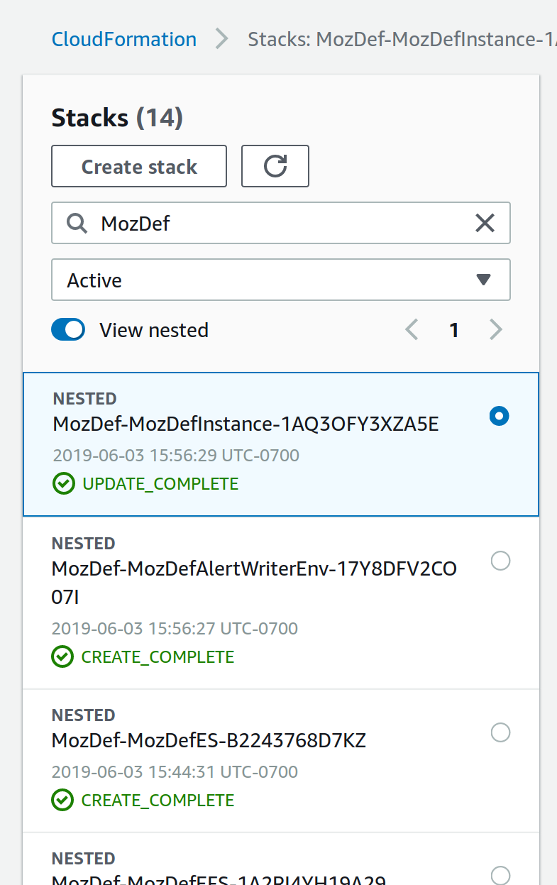
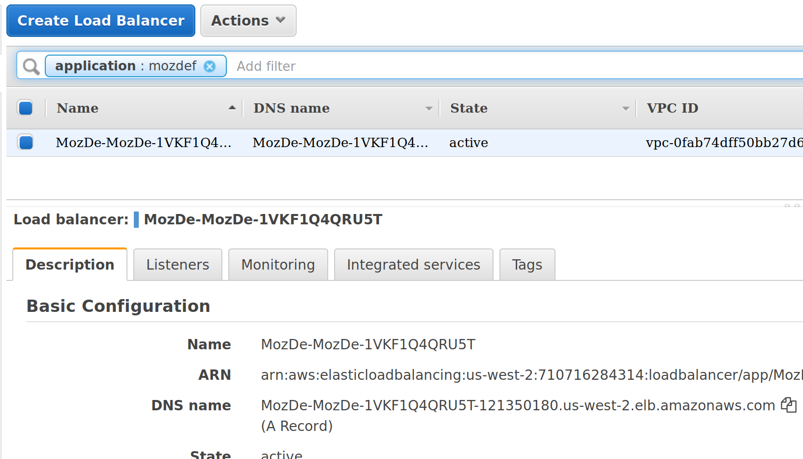

# Security Simulation Overview

## Log in to your lab AWS account

Event Engine login details go here

## Explore the AWS account contents

Familiarize yourself with the contents of your account. You'll find MozDef is
deployed in your account using CloudFormation. 

* Browse to the [CloudFormation product in the AWS console](https://us-west-2.console.aws.amazon.com/cloudformation/home).
* Limit the CloudFormation stacks shown in the console by typing `mozdef` in the
  stack search bar and hitting <kbd>Enter</kbd>
  
  * You'll see both the root CloudFormation stack called `MozDef` as well as
    the various nested stacks. All the AWS resources that makeup MozDef can be
    found in these stacks.
* Browse to the [Lambda product in the AWS console](https://us-west-2.console.aws.amazon.com/lambda/home).
  * Click the `MozDef-MozDefAlertWriterEnv` Lambda function to see an example
    MozDef alert and author your own
    
* Browse to the [EC2 product in the AWS console](https://us-west-2.console.aws.amazon.com/ec2/v2/home).
* View [Load Balancers](https://us-west-2.console.aws.amazon.com/ec2/v2/home?region=us-west-2#LoadBalancers:)
  to find the AWS Application Load Balancer (ALB) you'll use to access the MozDef
  web UI.
  * You can find the MozDef ALB by searching for `tag:application : mozdef`
    
  * In the description field of the load balancer you'll see the DNS name of the
    load balancer. Click the copy  icon to
    copy the URL to your clipboard.
* Paste the URL into another tab to browse to the MozDef web UI

