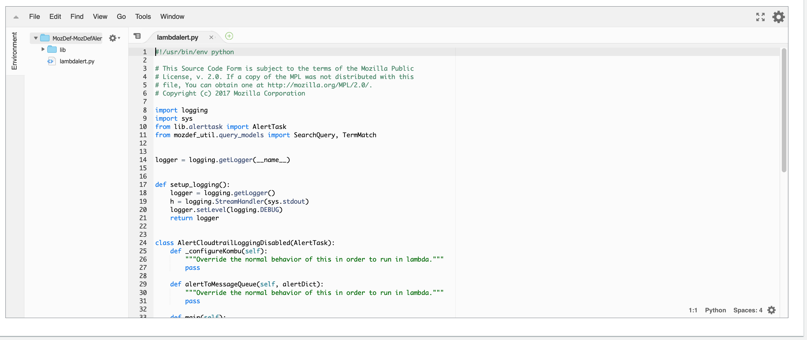

# Exploration and Alert Authoring

By now you have explored the MozDef web interface, understood how data is ingested, examined the data sources, and heard about the attack simulation taking place in your account.
It's time to take that understand and use *AWS Lambda* along with the MozDef alert framework to craft some automated detection.  
In order to write an alert we must understand how the alert system reasons about data.

In a normal MozDef alert flow the system ingests messages from SQS or other style message queue.  The message is required to be 
normalized in the MozDef [event format](https://github.com/mozilla/MozDef/blob/master/docs/source/usage.rst).

### Alerts can be triggered one of two ways:

* __On Event__ - an alert reasons about a single message.
* __On aggregation__ - alert runs periodically to reason about many messages inside of a progressively sliding time window. 

### Lambda alert writers environment:

In order to familiarize you with the MozDef alert framework and doing some coding in python we have provided you with a single lambda function running inside of the same VPC that the instance of ElasticSearch is running in.  This means that you can hack on a bit of code to detect some of the IOCs that were presented in the security simulation briefing.

Go ahead and navigate to the lambda environment in your console.


> Note: these have only been deployed in the us-west-2 region.


You should see a lambda function similarly name to the one above.  Click on it to see the Cloud9 IDE.



Scroll down past the boiler plate code to turn on the python logger to find an object in python called: `AlertCloudTrailLoggingDisabled`.

Pay careful attention to the methods within the object called: `onEvent` and `main`

`main` is designed to take a single event and then perform a search in elastic whereas `onEvent` will execute if the search terms are matched in elastic.  Uncomment lines _38 - 41_ and customize the search terms in order to modify the alert to match on `StopLogging` instead of `DescribeTable`.

AWS Lambda will retry if the function doesn't return `200`.  Change the last three lines of the function to instead be:

```python
    logger.debug('Function initialized.')
    a = AlertCloudtrailLoggingDisabled()
    print(a.main())
    return 200
```
This should result in the function executing, printing a status you can see, and exiting appropriately when you push the test button.

> **Note**: you may also elect to customize the messaging in the `main` object.  Ultimately this is what will surface on the alerts page in the MozDef UI.  

When ready to test your code feel free to push the "Test" button in lambda.  If no test event structure is configured feel free to create one.  Since we'll be running this manually or as a CloudWatch Event cron the `event` payload passed in from AWS Lambda will be ignored. 

**Congratulations** you have just written your first alert in MozDef.  Feel free to play with the alert terms a bit to understand just how much flexibility there is in the "simple" onEvent style alert.  

You may also run multiple alerts inside the same lambda function by copying and pasting the code block called `AlertCloudTrailLoggingDisabled` and adding them to the main lambda event handler. 

_Note:_ that these classes must have unique names inside of the same lambda function.  The names should be descriptive of what you are attempting to alert on.  

For example if you wanted to generate an alert every time there was a console login you might write a class that looks like:

```python
class AlertMyFirstAlert(AlertTask):
    def _configureKombu(self):
        """Override the normal behavior of this in order to run in lambda."""
        pass

    def alertToMessageQueue(self, alertDict):
        """Override the normal behavior of this in order to run in lambda."""
        pass

    def main(self):
        # How many minutes back in time would you like to search?
        search_query = SearchQuery(minutes=15)

        # What would you like to search for?
        search_query.add_must([
            TermMatch('source', 'vpc_flow'), # The source is vpc_flow logs
            TermMatch('details.destinationport', 22)
        ])

        self.filtersManual(search_query)
        self.searchEventsSimple()
        self.walkEvents()

    def onEvent(self, event):
        category = 'vpc_flow'

        # Useful tag and severity rankings for your alert.
        tags = ['aws', 'vpc_flow']
        severity = 'WARNING'

        # What message should surface in the user interface when this fires?
        summary = 'A user attempted an ssh session to port 22.'

        # This could also include correlating the number of bytes exchanged # to understand if this was a successful SSH session vs a tcp RESET

        return self.createAlertDict(summary, category, tags, [event], severity)

        # Learn more about MozDef alerts by exploring the "Alert class!"

```

Then we simply add our new class to the main method in order to get the alert to run.

```python
    logger.debug('Function initialized.')
    a = AlertCloudtrailLoggingDisabled()
    b = AlertMyFirstAlert()
    print(a.main())
    print(b.main())
    return 200
```

> Now both alerts run as part of a single lambda execution.  If the alerts match on terms you will see these surface in the MozDef UI.