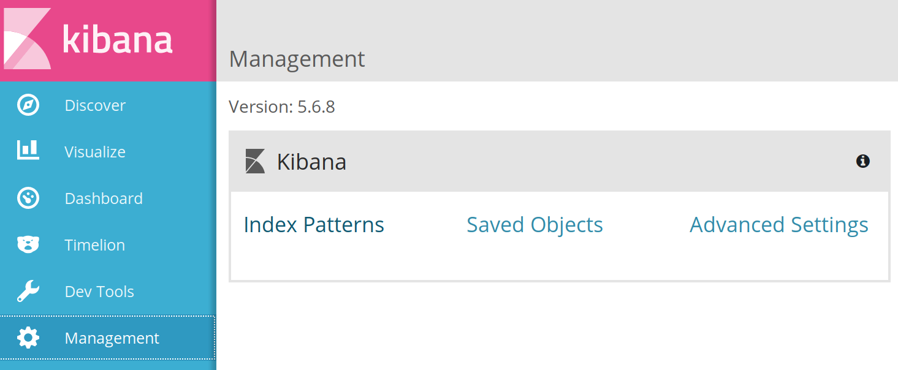
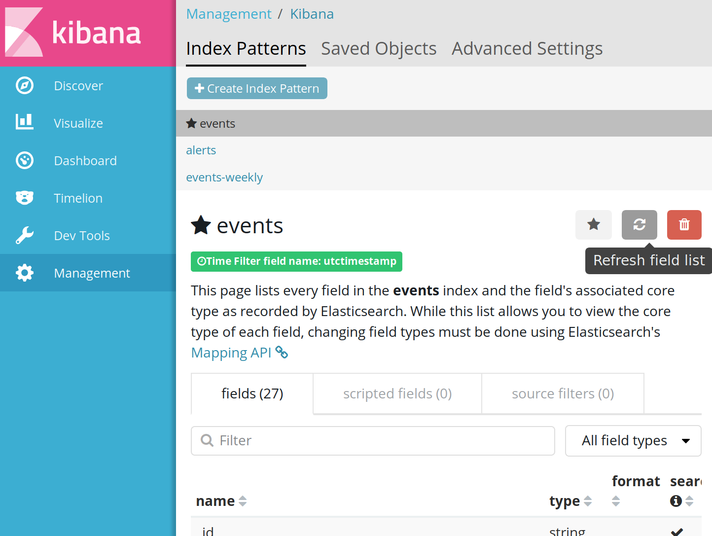

# Investigating

You've seen an alert or are exploring an issue (*you're threat hunting*). You now need to be able to dive into the
event data and figure out what happened, to what extent, which systems are involved and so on.

## Setup

Now that you have a working MozDef with real data in it, you will want to have
Kibana refresh the field list based on the real data now present. This will
enable you to search and filter on these fields.

* Browse to MozDef using the load balancer DNS name. Then click `KIBANA` in the
  menu bar.
* In Kibana click the `Management` tab on the left
* On the Management page click `Index Patterns`
  
* On the Index Patterns page, in the `events` index area, click the refresh icon
  on the right (between the star and the trash can icons) to refresh the field
  list.
  
* Return to the `Discover` tab and you'll find that you can now search or filter
  on any field.

## SSH Traffic from the Outside

### Scenario

As a security engineer, you imagine that at some point, there will be unwanted SSH connections going to systems that no
one normally connects to. You're tasked with making sure that when it happens you'll be able to find out.
In our workshop sandbox, we've simulated that event for you.

Would you be able to find the connections attempts? Can you tell which one were successful (i.e. attacker got a shell)?
Using the learnings from the previous lab, can you draft how an alert for this event would look like?

> **Tip**: Successful SSH connections result in more data being sent over the wire than unsuccessful ones. Look for vpc
> flow data!

### Breadcrumbs

- Find connections to the conventional SSH port: 22 (TCP)
- Figure out the event format
- Find a way to understand if the connection was successful (attacker got a shell) or not

> **Note**: In a real environment, SSH may be running on different ports, so you might need some protocol analysis as
> well. Additionally, in some cases you might want to use different log sources, such as SSH logs themselves, if
> available - or use them in combination with other types of logs.

## Alert : Attacker is determining what permissions they have

### Scenario

The scenario description would go here

### Goal

Determine what IAM user or role is making a large number of Describe calls to
the AWS API

### What to do

* Look for unusual patterns of AWS API calls visually
  * In Kibana, restrict the records you're looking at to only CloudTrail logs which
    have a `category` value of `AwsApiCall` as well as a `source` of `cloudtrail`
  * Further limit the records you see in Kiabana using the `details.eventverb`
    field to view only describe calls.
  * Set the window of time that you're looking at to start 6 hours before the
    class began.
  * Look in the graph of events for unusually large amounts of describe API
    calls
  * Zoom into the time window around the spike in API calls
* Once you've identified the filters and time window that you want, you can
  visualize the data to understand what IAM users or roles are causing the
  calls
  * Click `Save` to save the search query and filters
  * Note the field that you want to visualize by looking in one of the records
    and copy pasting the field name
  * Click the `Visualize` tab
  * Click the plus sign to add a new visualization
  * Click `Pie` to create a pie chart
  * Click the saved search you just saved
  * Click `Split Slices`
  * In `Aggregation` choose `Terms`
  * In `Field` paste the term name that you want to visualize
  * Click the play icon to run the visualization
  
    

